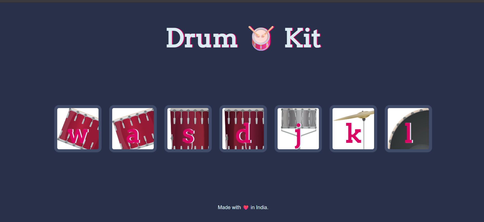

# 🥁 Drum Kit

A fun and interactive Drum Kit web application built using **HTML**, **CSS**, and **JavaScript**.  
Click the drum buttons or press corresponding keys on your keyboard to play different drum sounds!

---

## 🚀 Features
- Responsive design
- Smooth animations
- Keyboard key support (`W`, `A`, `S`, `D`, `J`, `K`, `L`)
- Realistic drum sounds

---

## 🧠 How It Works
Each button represents a specific drum sound. When you click or press a key:
1. A corresponding drum sound plays.
2. The button animates to show feedback.

---

## 🚀 Live Demo  
👉 [Click here to play the Drum Kit!](https://manendraadvani.github.io/Drum-Kit-Application/)

---

## 📸 Preview


---

## 🧩 Technologies Used

- **HTML5** – for structure  
- **CSS3** – for styling and animations  
- **JavaScript (ES6)** – for interactive sound functionality  

---

## 🗂️ Project Structure

```
Drum-Kit-Application/
│
├── images/ # Drum images used in buttons
├── sounds/ # Drum sound files
├── index.html # Main HTML file
├── styles.css # CSS for layout and styling
└── index.js # JavaScript logic
```

---

## 🖥️ Run Locally
Clone the project:

```bash
# Clone the repository
git clone https://github.com/Manendraadvani/Drum-Kit-Application.git

# Navigate to the project folder
cd Drum-Kit-Application

# Open index.html in your browser
